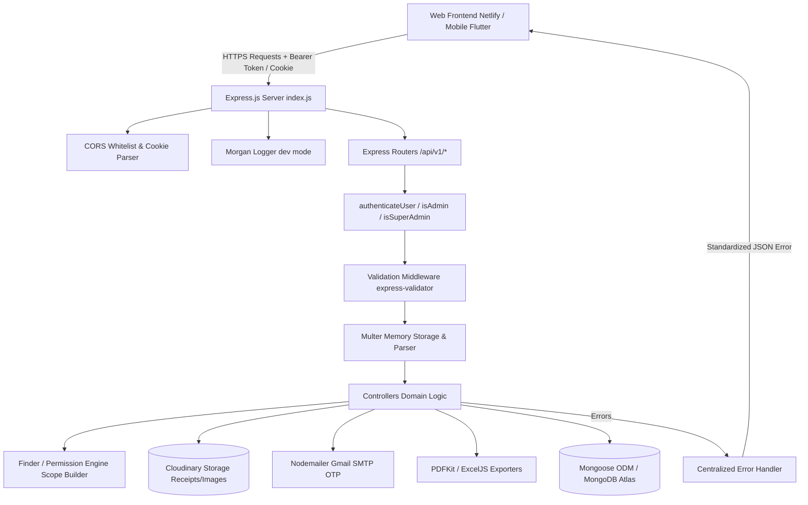
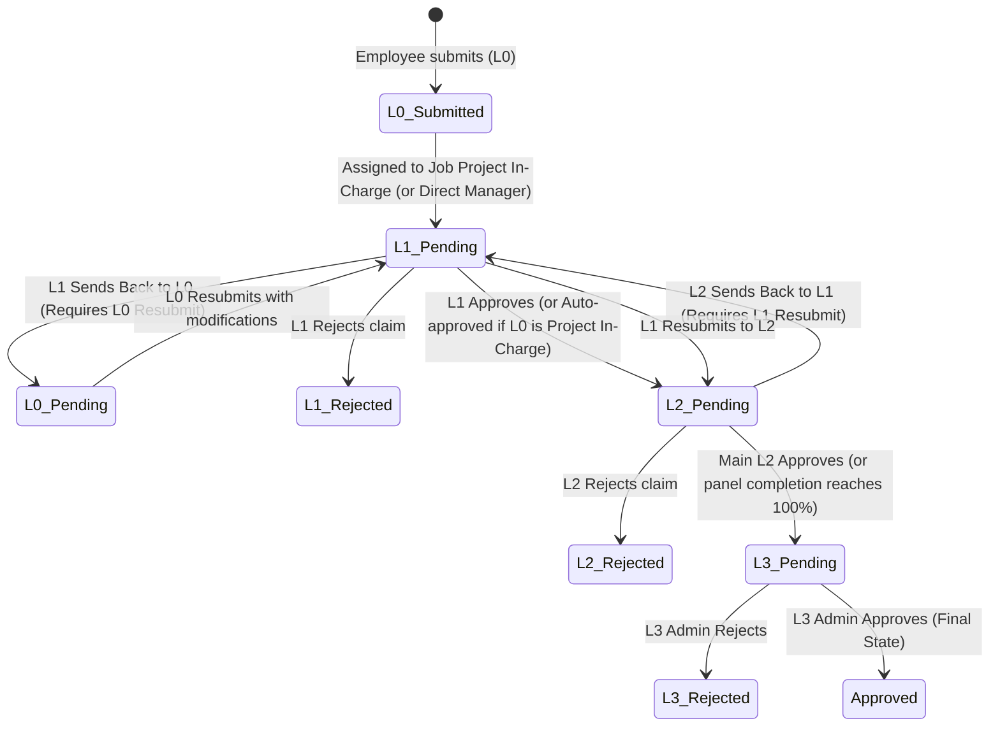
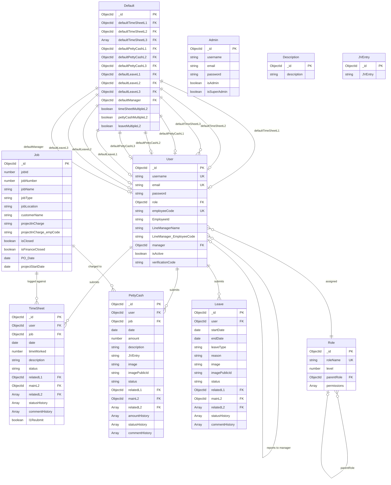

# DEVELOPER HANDOVER & TECHNICAL DOCUMENTATION
**Project:** Sysense-Background (Sysense Backend API)  
**Document Author:** Senior Software Engineer / Technical Architect  
**Handover Date:** August 2026  
**Target Audience:** Incoming Backend Developers, Full-Stack Engineers, DevOps Engineers, and System Architects

---

## 1. PROJECT OVERVIEW

### Project Name
**Sysense-Background** (Sysense Backend API Service)

### Project Type
- **Backend REST API Service** (Enterprise Multi-Tier Operations, Timesheet, Petty Cash, Leave Management & Hierarchical Approval Workflow Engine)

### Main Purpose of the Project
Sysense-Background provides the backend APIs and business logic powering the Sysense enterprise workforce and project operations suite. It manages timesheet logging against client jobs, petty cash reimbursement tracking with receipt image uploads, leave application and quota tracking, hierarchical multi-stage approvals (L0 -> L1 -> L2 -> L3), role-based scoped data access, dynamic PDF/Excel report generation, and administrative job/user master data management.

### Business Problem It Solves
1. **Multi-Stage Operational Approvals:** Eliminates paper/manual approvals by implementing strict 3-tier approval chains (L1 Team Lead / Project In-Charge -> L2 Line Manager / Division Head -> L3 General Management / Admin) for timesheets, petty cash expenses, and leave requests.
2. **Workforce Hours Compliance:** Enforces validation preventing employees from exceeding 8 daily logged hours across all assigned client jobs, while preventing duplicate timesheet entries per job/day.
3. **Receipt & Expense Auditability:** Enables field engineers to upload expense receipts (processed via Multer and stored in Cloudinary), track budget modifications through explicit history logs (`amountHistory`, `statusHistory`, `commentHistory`), and link expenses to Job accounting codes (JV Entry).
4. **Hierarchical Scoped Data Visibility:** Enforces strict role permission scopes (`self`, `children`, `sameLevelChildren`, `sameLevel`, `organization`) allowing managers to only view or report on data within their organizational tree.
5. **Automated Export & Auditing:** Dynamically generates downloadable PDF documents (via PDFKit) and multi-tab Excel spreadsheets (via ExcelJS) for employee audits and organizational reporting.

### Main Users / User Roles
- **L0 Submitter / Field Engineers / Staff:** Submits daily timesheets against specific active jobs, files petty cash claims with receipts, and applies for leaves. Can edit and resubmit if sent back by L1.
- **L1 Approver (Project In-Charge / Direct Supervisor):** Reviews, modifies, rejects, approves, or sends back L0 submissions. If the submitter is the project in-charge themselves, timesheets auto-advance to L2.
- **L2 Approver (Line Manager / Multi-Manager Panel):** Reviews L1-approved submissions. Supports both single-manager approval and multi-manager panel stages (`stages`, `completed`, `users`). Can approve, modify, reject, or send back to L1 for correction.
- **L3 Approver (Finance / HR / General Management / Admin):** Final approval authority designated via global default configuration (`Default` collection). Can approve (sets status to `"Approved"`), reject, or bulk-approve/delete items.
- **Admin / Super Admin:** Authenticates via the admin portal (`Admin` collection), manages user accounts, configures jobs/projects, manages role hierarchy and permissions, and configures system-wide default approvers.

### Brief Description of How the System Works
The backend is built with Express.js and Node.js using ES Modules (`"type": "module"`). It interfaces with MongoDB via Mongoose. Incoming requests are authenticated using JSON Web Tokens (JWT) transmitted either via `Bearer` Authorization headers (for mobile/Flutter clients) or `httpOnly` cookies (for web clients). Routes validate inputs using `express-validator` and execute business logic in dedicated controllers. Submissions move through a deterministic state machine (`L0 Pending` -> `L1 Pending` -> `L2 Pending` -> `L3 Pending` -> `Approved` / `Rejected`). When approved or rejected, audit records are appended to `statusHistory` and `commentHistory`.

### Current Project Status
- **Core API & Workflow Engine:** Fully Functional (Timesheets, Petty Cash, Leaves, Defaults, Reports, Roles, Admin).
- **Authentication & Security:** Functional JWT token generation and cookie handling, but contains testing bypasses for Admin passwords and password update hashing that require immediate production hardening.
- **Continuous Deployment:** Configured via GitHub Actions running on a self-hosted runner restarting PM2 process `BACKEND-API`.

---

## 2. TECHNOLOGY STACK

| Layer | Technology | Version / Specification | Purpose |
|---|---|---|---|
| **Runtime Environment** | Node.js | v22.x (ES Modules) | Server-side JavaScript runtime |
| **Backend Framework** | Express.js | `^5.1.0` | HTTP web server and REST API framework |
| **Database** | MongoDB | Atlas / Cloud Replica Set | Document-oriented NoSQL database |
| **Database ODM** | Mongoose | `^8.19.1` | Schema definition, validation, and MongoDB object modeling |
| **Authentication & Tokens** | JSON Web Tokens (`jsonwebtoken`) | `^9.0.2` | Stateless user and admin session token signing and verification |
| **Password Hashing** | `bcryptjs` | `^3.0.2` | Salt generation and cryptographic password hashing |
| **Input Validation** | `express-validator` | `^7.2.1` | Schema-based request body, query, and parameter validation middleware |
| **File Upload Handling** | `multer` + `datauri` | Multer `^2.0.2`, DataURI `^4.1.0` | Memory-buffered multipart form data parsing and image formatting |
| **Cloud Storage** | Cloudinary SDK (`cloudinary`) | `^2.8.0` | Cloud media storage for leave medical certificates & petty cash receipts |
| **Email Service** | `nodemailer` | `^7.0.9` | SMTP email transport for OTP password reset notifications (Gmail SMTP) |
| **PDF Generation** | `pdfkit` + `pdfkit-table` | PDFKit `^0.17.2`, Table `^0.1.99` | Dynamic stream generation of formatted PDF audit reports |
| **Excel Export** | `exceljs` | `^4.4.0` | Dynamic workbook and multi-tab spreadsheet generation |
| **Date Manipulation** | `date-fns` | `^4.1.0` | Date interval calculations, relative subWeeks/subMonths logic |
| **HTTP Status Codes** | `http-status-codes` | `^2.3.0` | Standardized HTTP response status constants |
| **HTTP Logging** | `morgan` | `^1.10.1` | Short HTTP request logging in development environment |
| **Cookie Parsing** | `cookie-parser` | `^1.4.7` | Parse HTTP cookie headers for JWT authentication |
| **CORS Middleware** | `cors` | `^2.8.5` | Cross-Origin Resource Sharing with origin whitelist and credential support |
| **Process Manager** | PM2 | Server installation | Production process monitoring and zero-downtime reloads |
| **CI/CD** | GitHub Actions | Self-hosted runner | Automated deployment pipeline triggered on push to `main` |

---

## 3. PROJECT STRUCTURE

```
Sysense-Background/
├── .github/
│   └── workflows/
│       └── node.js.yml            # GitHub Actions CI/CD workflow (Node 22, PM2 deployment)
├── controllers/                   # Route business logic handlers
│   ├── JVEntryController.js       # Query JV accounting codes
│   ├── adminController.js         # Admin auth, user & job master management
│   ├── authController.js          # User registration, login, OTP reset, logout
│   ├── defaultController.js       # System fallback approvers & L2 multi-toggle config
│   ├── descriptionController.js   # Timesheet pre-defined description queries
│   ├── jobController.js           # Client jobs listing for staff
│   ├── leaveController.js         # 3-tier leave application & approval workflows
│   ├── pettyCashController.js     # 3-tier petty cash expense & receipt workflows
│   ├── reportController.js        # PDF & Excel scoped report controllers
│   ├── roleController.js          # RBAC role, permissions & scope management
│   ├── timesheetController.js     # 3-tier timesheet logging, 8h cap & workflows
│   └── userController.js          # Profile management, stats dashboard
├── errors/
│   └── customErrors.js            # Custom error classes (NotFoundError, BadRequestError, etc.)
├── middlewares/
│   ├── authenticationMiddleware.js# JWT verification, isAdmin, isSuperAdmin checks
│   ├── errorHandlerMiddleware.js  # Global centralized error handler
│   ├── multerMiddleware.js        # In-memory file upload filter (PNG/JPEG/WebP, 50KB limit)
│   └── validationMiddleware.js    # express-validator rules for all endpoints
├── models/                        # Mongoose data schemas
│   ├── Admin.js                   # Admin & SuperAdmin accounts schema
│   ├── Default.js                 # Global fallback approver IDs & multi-L2 flags
│   ├── Description.js             # Standard timesheet task descriptions
│   ├── JVEntry.js                 # Journal Voucher account categories
│   ├── Job.js                     # Project master data, project in-charge mappings
│   ├── Leave.js                   # Leave claims, statusHistory & multi-L2 state
│   ├── PettyCash.js               # Petty cash claims, receipts, amountHistory
│   ├── Role.js                    # RBAC hierarchical roles, modules, action scopes
│   ├── TimeSheet.js               # Timesheet logs, hours worked, approval history
│   └── User.js                    # Employee master, manager tree, credentials
├── routers/                       # Express router definitions
│   ├── JVEntryRouter.js           # /api/v1/jv-entry
│   ├── adminRouter.js             # /api/v1/admin
│   ├── authRouter.js              # /api/v1/auth
│   ├── defaultRouter.js           # /api/v1/defaults
│   ├── descriptionRouter.js       # /api/v1/description
│   ├── jobRouter.js               # /api/v1/jobs
│   ├── leaveRouter.js             # /api/v1/leave
│   ├── pettyCashRouter.js         # /api/v1/pettycash
│   ├── reportRouter.js            # /api/v1/report
│   ├── roleRouter.js              # /api/v1/role
│   ├── timesheetRouter.js         # /api/v1/timesheet
│   └── userRouter.js              # /api/v1/user
├── scripts/
│   └── seedPasswords.js           # Utility script to migrate unhashed plaintext passwords to bcrypt
├── utils/
│   ├── bcrypt.js                  # Password hash & compare functions + batch seeder
│   ├── finder.js                  # Dynamic resolution for L1/L2 approvers & default fallbacks
│   ├── generateReportFunction.js  # PDFKit table formatting & ExcelJS worksheet builders
│   ├── jwtUtils.js                # JWT signing (10d expiration) & verification
│   ├── nodeMailer.js              # Nodemailer Gmail transport & sender
│   ├── permissionFns.js           # canPerformAction & buildScopeQuery RBAC engine
│   ├── readme.md                  # Architectural specification of the permission engine
│   ├── regex.js                   # Case-insensitive RegExp generator helper
│   ├── sampleData.json            # Seed dataset for descriptions
│   └── utilityFunctions.js        # 8-hour cap validator, duplicate check & restriction arrays
├── .env                           # Local environment variables (DO NOT COMMIT)
├── .gitignore                     # Git exclusion rules
├── index.js                       # Application entry point, Express config, DB connect & server start
├── mockData.js                    # Database seed script for Description data
├── package.json                   # Project dependencies and npm scripts
└── package-lock.json              # Locked dependency versions
```

### Folder Responsibilities

- **`index.js`**: Initializes Express, configures CORS, JSON/URL-encoded parsers, cookie parser, Morgan logger, Cloudinary SDK, registers all API routes under `/api/v1`, mounts the 404 handler, registers `errorHandleMiddleware`, connects to MongoDB via `mongoose.connect(process.env.MONGODB_URI)`, and starts the HTTP server on port 3000.
- **`controllers/`**: Encapsulates all domain logic. Translates HTTP requests into database operations, enforces state machine rules, performs authorization validations, and formats JSON/file responses.
- **`models/`**: Houses Mongoose schemas defining database structure, timestamps, field types, embedded subdocuments (`statusHistorySchema`, `commentHistorySchema`, `amountHistorySchema`, `l2StatusSchema`), and index constraints.
- **`middlewares/`**: Houses pipeline interceptors including JWT authentication (`authenticateUser`), role authorization (`isAdmin`, `isSuperAdmin`), Multer in-memory file parsing, express-validator rule wrappers (`withValidationErrors`), and the centralized error handling middleware.
- **`utils/`**: Reusable helper utilities for cryptographic operations, hierarchical manager resolution, PDF/Excel generation, email dispatching, and dynamic MongoDB scope query construction.

---

## 4. APPLICATION ARCHITECTURE

### Overall Architecture
The system uses a classical **Layered MVC/Service Architecture** built on Express.js with a MongoDB document database.



### Request Lifecycle & Workflow State Engine
Submissions in `TimeSheet`, `PettyCash`, and `Leave` follow a multi-tier lifecycle:



### Dynamic Approver Resolution Engine (`utils/finder.js`)
When an employee submits a record:
1. **Timesheet L1:** Mapped to the Job's `projectInCharge_empCode`. If user is not found, falls back to `Default.defaultTimeSheetL1`.
2. **Timesheet L2:** Mapped to the Submitter's direct `manager` from the `User` model. If missing, falls back to `Default.defaultTimeSheetL2`.
3. **Petty Cash L1:** Mapped to the Submitter's direct `manager`. If missing, falls back to `Default.defaultPettyCashL1`.
4. **Petty Cash L2:** Mapped to the Job's `projectInCharge_empCode`. If user is not found, falls back to `Default.defaultPettyCashL2`.
5. **Leave L1 / L2:** Mapped to Submitter's direct `manager`. If missing, falls back to `Default.defaultLeaveL1` / `defaultLeaveL2`.
6. **L3 (All Modules):** Retrieved from global `Default` configuration document (`defaultTimeSheetL3`, `defaultPettyCashL3`, `defaultLeaveL3`).

---

## 5. LOCAL DEVELOPMENT SETUP

### Prerequisites
- **Node.js**: `v20.x` or `v22.x` (Workflow specifies `Node 22.x`)
- **NPM**: `v10.x` or higher
- **MongoDB**: Access to a MongoDB database (Local MongoDB instance or MongoDB Atlas connection string)
- **Cloudinary Account**: Required for image uploads (receipts and medical certificates)
- **Gmail Account / SMTP Credentials**: Required for password reset OTP emails

### Step-by-Step Installation

#### 1. Clone the Repository
```bash
git clone <REPOSITORY_URL>
cd Sysense-Background
```

#### 2. Install Dependencies
```bash
npm install
```

#### 3. Configure Environment Variables
Create a `.env` file in the root directory (refer to Section 6 for variable templates):
```bash
touch .env
```

#### 4. Seed Essential Data (Optional / First-time setup)
If starting with an empty database:
- To seed task descriptions from `utils/sampleData.json`:
  ```bash
  node mockData.js
  ```
- To hash existing plaintext legacy user passwords:
  ```bash
  node scripts/seedPasswords.js
  ```

#### 5. Start the Development Server
```bash
npm start
```
*Note: `npm start` runs `nodemon index.js`. The server will start and listen on port `3000` (or `http://localhost:3000`).*

#### 6. Verify Server Health
Open a browser or API client (Postman / Thunder Client) and execute:
```http
GET http://localhost:3000/
```
Expected response: `Welcome to Sysense Server` (Status `200 OK`).

---

## 6. ENVIRONMENT VARIABLES & CONFIGURATION

The application utilizes `dotenv` to load environment variables from `.env` in `index.js` and utility files.

| Variable Name | Required | Purpose | Where Used | Example / Fallback Value |
|---|---|---|---|---|
| `MONGODB_URI` | **Yes** | Primary MongoDB connection string | `index.js`, `mockData.js`, `scripts/seedPasswords.js` | `mongodb+srv://<user>:<pwd>@cluster.mongodb.net/Sysense?retryWrites=true&w=majority` |
| `MONGODB_URI_PROD` | No | Production database URI reference | Configuration reference | `mongodb+srv://<user>:<pwd>@prod-cluster.mongodb.net/Sysense` |
| `NODE_ENV` | **Yes** | Execution mode (`development` or `production`) | `index.js` (Morgan logging), `authController.js` (Cookie secure flag) | `development` / `production` |
| `JWT_SECRET` | **Yes** | Secret key for signing and verifying JWT tokens | `utils/jwtUtils.js`, `controllers/authController.js` | `Credential source must be verified with the project administrator.` |
| `NODEMAILER_EMAIL` | **Yes** | Gmail / SMTP sender address for OTP emails | `utils/nodeMailer.js`, `controllers/authController.js` | `notifications@yourcompany.com` |
| `NODEMAILER_PASS` | **Yes** | Gmail App Password or SMTP password | `utils/nodeMailer.js` | `Credential source must be verified with the project administrator.` |
| `CLOUDINARY_CLOUD_NAME`| **Yes** | Cloudinary account cloud identifier | `index.js`, `controllers/pettyCashController.js`, `controllers/leaveController.js` | `your_cloud_name` |
| `CLOUDINARY_API_KEY` | **Yes** | Cloudinary API Key | `index.js` | `Credential source must be verified with the project administrator.` |
| `CLOUDINARY_API_SECRET` | **Yes** | Cloudinary API Secret | `index.js` | `Credential source must be verified with the project administrator.` |
| `PROD_ENV_FILE` | CI/CD | GitHub Actions Secret containing full production `.env` | `.github/workflows/node.js.yml` | Injected during GitHub Actions pipeline |

> [!WARNING]
> Never commit `.env` containing live secrets, production database connection strings, or Cloudinary credentials into Git repositories.

---

## 7. CORE FEATURES & MODULES

### 1. Authentication & Identity Management
- **Files**: `controllers/authController.js`, `routers/authRouter.js`, `utils/bcrypt.js`, `utils/jwtUtils.js`, `utils/nodeMailer.js`
- **Functionality**:
  - User self-registration with employee code uniqueness validation.
  - User login with password verification, issuing a 10-day JWT via `token` cookie and JSON payload.
  - 4-digit OTP forgot password flow dispatched via Nodemailer.
  - OTP verification and secure password reset.
  - Logout clearing session cookies with an expired 1-second token.

### 2. Timesheet Module
- **Files**: `controllers/timesheetController.js`, `routers/timesheetRouter.js`, `models/TimeSheet.js`, `utils/utilityFunctions.js`
- **Functionality**:
  - Daily time logging against specific jobs.
  - Strict daily 8-hour cap validation across all jobs per user per day (`checkFor8Hour`).
  - Prevention of duplicate timesheet submissions for the same job and date (`checkDuplicateJobTimeSheet`).
  - Auto-promotion: If submitter is the job's project in-charge (L1), status automatically advances to `L2 Pending`.
  - 3-tier multi-level workflow: L1 review/modify/approve/send back -> L2 review/modify/approve/send back -> L3 review/bulk-approve/delete.
  - Multi-L2 panel approvals: Tracks completed stages vs total required stages.
  - Weekly and Monthly employee time summaries formatted as `worked/8` hours per calendar day.

### 3. Petty Cash Expense Management
- **Files**: `controllers/pettyCashController.js`, `routers/pettyCashRouter.js`, `models/PettyCash.js`, `middlewares/multerMiddleware.js`
- **Functionality**:
  - Petty cash logging with amount, date, description, JV Entry account, and optional receipt image upload.
  - In-memory image processing via Multer with Cloudinary CDN upload.
  - Audit trail of amount revisions stored in `amountHistory` (tracking `amount`, `prevAmount`, `changedBy`, `changedOn`).
  - 3-tier approval hierarchy with L1 / L2 / L3 approve, modify, reject, and send back mechanisms.

### 4. Leave Application & Quota Overview
- **Files**: `controllers/leaveController.js`, `routers/leaveRouter.js`, `models/Leave.js`
- **Functionality**:
  - Employee leave submission with date range, leave type, reason, and optional supporting document upload.
  - Annual leave overview aggregating total leaves taken categorized into Sick, Earned, and Casual leaves.
  - 3-tier approval hierarchy matching the enterprise lifecycle.

### 5. Hierarchical RBAC & Permissions Engine
- **Files**: `controllers/roleController.js`, `routers/roleRouter.js`, `models/Role.js`, `utils/permissionFns.js`, `utils/readme.md`
- **Functionality**:
  - Role management with numeric hierarchy levels (`level`), parent roles, and module action scopes.
  - Scope levels: `self`, `children` (subordinates), `sameLevelChildren` (sibling teams), `sameLevel` (peers), and `organization` (entire company).
  - Dynamic MongoDB query generation (`buildScopeQuery`) to filter accessible users according to role scope.

### 6. Dynamic Reporting Engine (PDF & Excel)
- **Files**: `controllers/reportController.js`, `routers/reportRouter.js`, `utils/generateReportFunction.js`
- **Functionality**:
  - Generates downloadable PDF reports formatted in A4 with header tables, summaries, and timestamp conversions (`Asia/Dubai` timezone).
  - Generates multi-tab Excel workbooks (`Timesheets`, `PettyCash`, `Leaves`) using ExcelJS with styled headers and audit trails.
  - Supports both single-user reports and organizational scoped reports.

### 7. Administrative Master Data & System Defaults
- **Files**: `controllers/adminController.js`, `controllers/defaultController.js`, `routers/adminRouter.js`, `routers/defaultRouter.js`, `models/Admin.js`, `models/Default.js`, `models/Job.js`
- **Functionality**:
  - Admin login authentication.
  - User master management (create, edit, paginated list, search, dropdowns).
  - Job/Project master management (create, edit, paginated search, finance closure flag).
  - Global default approver configuration (`defaultTimeSheetL1`, `defaultTimeSheetL2`, `defaultTimeSheetL3`, etc.) and multi-L2 approval mode toggles.

---

## 8. DATABASE DOCUMENTATION

### Database Overview
- **Type**: MongoDB (Document-based NoSQL)
- **ODM**: Mongoose v8.19.1
- **Schema Management**: Defined programmatically in `models/*.js` with Mongoose schemas and timestamps enabled (`createdAt`, `updatedAt`).

### Entity Relationship Diagram



### Models & Collections Specification

| Model / Collection | File Path | Key Fields & Types | Purpose & Relationships |
|---|---|---|---|
| **User** (`users`) | `models/User.js` | `username` (Str), `email` (Str), `password` (Str), `employeeCode` (Str), `EmployeeId` (Str), `role` (ObjectId -> `Role`), `manager` (ObjectId -> `User`), `isActive` (Bool) | Master user profile & hierarchical manager pointer. |
| **Admin** (`admins`) | `models/Admin.js` | `username` (Str), `email` (Str), `password` (Str), `isAdmin` (Bool), `isSuperAdmin` (Bool) | Admin authentication credentials & authorization roles. |
| **Job** (`jobs`) | `models/Job.js` | `jobId` (Num), `jobNumber` (Num), `jobName` (Str), `jobType` (Str), `jobLocation` (Str), `customerName` (Str), `projectInCharge_empCode` (Str), `isFinanceClosed` (Bool) | Client projects/jobs referenced in Timesheets and Petty Cash. |
| **TimeSheet** (`timesheets`) | `models/TimeSheet.js` | `user` (ObjectId -> `User`), `job` (ObjectId -> `Job`), `date` (Date), `timeWorked` (Num), `description` (Str), `status` (Str), `relatedL1` ([ObjectId]), `mainL2` (ObjectId), `statusHistory` ([SubDoc]) | Daily timesheet logs and multi-tier approval audit trail. |
| **PettyCash** (`pettycashes`)| `models/PettyCash.js` | `user` (ObjectId), `job` (ObjectId), `amount` (Num), `description` (Str), `JVEntry` (Str), `image` (Str), `amountHistory` ([SubDoc]), `statusHistory` ([SubDoc]) | Field expense claims with receipt image and amount modification logs. |
| **Leave** (`leaves`) | `models/Leave.js` | `user` (ObjectId), `startDate` (Date), `endDate` (Date), `leaveType` (Str), `reason` (Str), `status` (Str), `image` (Str), `statusHistory` ([SubDoc]) | Employee leave requests and approval status tracking. |
| **Role** (`roles`) | `models/Role.js` | `roleName` (Str), `level` (Num), `parentRole` (ObjectId -> `Role`), `permissions` ([`module`, `actions: [{name, scope}]`]) | RBAC role definitions with scoped module actions. |
| **Default** (`defaults`) | `models/Default.js` | `defaultTimeSheetL1`, `defaultTimeSheetL2`, `defaultTimeSheetL3` (Array), `defaultPettyCashL1`..`L3`, `defaultLeaveL1`..`L3`, `timeSheetMultipleL2` (Bool) | Fallback approver user IDs and workflow configuration flags. |
| **Description** (`descriptions`)| `models/Description.js` | `description` (Str) | Pre-configured standard timesheet task description dropdown list. |
| **JVEntry** (`jventries`) | `models/JVEntry.js` | `JVEntry` (Str) | Journal Voucher accounting codes for petty cash expense allocation. |

---

## 9. API DOCUMENTATION

All API endpoints are prefixed with `/api/v1` (except root health check endpoints).

### 1. Root & Test Endpoints
| Method | Endpoint | Purpose | Authentication | Main Request Data |
|---|---|---|---|---|
| `GET` | `/` | Root server health check | Public | None |
| `GET` | `/api/dummy` | Test endpoint returning dummy JSON | Public | None |
| `GET` | `/api/v1/users` | List all users (direct userController route) | Public | None |

---

### 2. Authentication Module (`/api/v1/auth`)
| Method | Endpoint | Purpose | Authentication | Main Request Data |
|---|---|---|---|---|
| `POST` | `/api/v1/auth/register` | Register new employee account | Public | `{ username, email, password, code }` |
| `POST` | `/api/v1/auth/login` | Login user & issue JWT cookie/token | Public | `{ email, password }` |
| `POST` | `/api/v1/auth/forgot-password` | Generate & send 4-digit OTP email | Public | `{ email }` |
| `POST` | `/api/v1/auth/verify-otp` | Verify OTP code | Public | `{ email, code }` |
| `POST` | `/api/v1/auth/reset-password` | Reset password using verified code | Public | `{ email, code, password }` |
| `POST` | `/api/v1/auth/logout` | Clear user session cookie | Public | None |

---

### 3. User & Profile Module (`/api/v1/user`)
| Method | Endpoint | Purpose | Authentication | Main Request Data |
|---|---|---|---|---|
| `PATCH`| `/api/v1/user/update` | Update username / email | User JWT | `{ username, email }` |
| `PATCH`| `/api/v1/user/update-password` | Update account password | User JWT | `{ currentPassword, newPassword }` |
| `GET` | `/api/v1/user/info` | Fetch current user info & populated role | User JWT | None |
| `GET` | `/api/v1/user/all` | Get list of all users | User JWT | None |
| `GET` | `/api/v1/user/stats` | Aggregate dashboard statistics (totals, approved, pending, rejected) | User JWT | None |

---

### 4. Timesheet Module (`/api/v1/timesheet`)
| Method | Endpoint | Purpose | Authentication | Main Request Data |
|---|---|---|---|---|
| `POST` | `/api/v1/timesheet/add` | Submit timesheet (L0) | User JWT | `{ job, date, time, description, comment }` |
| `GET` | `/api/v1/timesheet/user` | Get submitted timesheets for logged-in user | User JWT | Query: `status, currentPage, search, startDate, endDate` |
| `GET` | `/api/v1/timesheet/user/overview` | Get weekly/monthly hours summary (`worked/8`) | User JWT | Query: `type=week|month` |
| `GET` | `/api/v1/timesheet/user/pendingL1` | Get pending timesheets for L1 review | User JWT | Query: `status, currentPage, search, startDate, endDate` |
| `PATCH`| `/api/v1/timesheet/user/rejectL1/:id` | Reject timesheet as L1 | User JWT | `{ comment }` |
| `PATCH`| `/api/v1/timesheet/user/sendBackL1/:id` | Send timesheet back to L0 from L1 | User JWT | `{ job, date, time, description, comment }` |
| `PATCH`| `/api/v1/timesheet/user/resubmitL0/:id` | Resubmit timesheet after L1 send-back | User JWT | `{ job, date, time, description, comment }` |
| `PATCH`| `/api/v1/timesheet/user/modifyL1/:id` | Modify timesheet data as L1 | User JWT | `{ job, date, time, description, comment }` |
| `PATCH`| `/api/v1/timesheet/user/approveL1/:id` | Approve timesheet as L1 (promotes to L2) | User JWT | `{ l2Users, comment }` |
| `GET` | `/api/v1/timesheet/user/pendingL2` | Get pending timesheets for L2 review | User JWT | Query: `status, currentPage, search, startDate, endDate` |
| `PATCH`| `/api/v1/timesheet/user/rejectL2/:id` | Reject timesheet as L2 | User JWT | `{ comment }` |
| `PATCH`| `/api/v1/timesheet/user/approveL2/:id` | Approve timesheet as L2 (promotes to L3) | User JWT | `{ comment }` |
| `PATCH`| `/api/v1/timesheet/user/modifyL2/:id` | Modify timesheet data as L2 | User JWT | `{ job, date, time, description, comment }` |
| `PATCH`| `/api/v1/timesheet/user/sendBackL2/:id` | Send timesheet back to L1 from L2 | User JWT | `{ job, date, time, description, comment }` |
| `PATCH`| `/api/v1/timesheet/user/resubmitL1/:id` | Resubmit timesheet to L2 after L2 send-back | User JWT | `{ job, date, time, description, comment }` |
| `GET` | `/api/v1/timesheet/user/pendingL3` | Get pending timesheets for L3 review | User JWT (L3) | Query: `status, currentPage, search, startDate, endDate` |
| `PATCH`| `/api/v1/timesheet/user/rejectL3/:id` | Reject timesheet as L3 | User JWT (L3) | `{ comment }` |
| `PATCH`| `/api/v1/timesheet/user/approveL3/:id` | Final approve timesheet as L3 (`Approved`) | User JWT (L3) | `{ comment }` |
| `DELETE`| `/api/v1/timesheet/user/deleteL3/:id` | Delete timesheet as L3 | User JWT (L3) | None |
| `PATCH`| `/api/v1/timesheet/user/bulk-approve-L2` | Bulk approve multiple timesheets as L2 | User JWT | `{ timesheetIds: [], comment }` |
| `PATCH`| `/api/v1/timesheet/user/bulk-approve-L3` | Bulk approve multiple timesheets as L3 | User JWT (L3) | `{ timesheetIds: [], comment }` |

---

### 5. Petty Cash Module (`/api/v1/pettycash`)
| Method | Endpoint | Purpose | Authentication | Main Request Data |
|---|---|---|---|---|
| `POST` | `/api/v1/pettycash/` | Submit petty cash claim (L0) with receipt | User JWT | Form Data: `job, date, amount, description, jvEntry, comment, image` |
| `GET` | `/api/v1/pettycash/user` | Get submitted petty cash for logged-in user | User JWT | Query: `status, currentPage` |
| `GET` | `/api/v1/pettycash/dataL1` | Get pending petty cash for L1 review | User JWT | Query: `status, currentPage` |
| `PATCH`| `/api/v1/pettycash/rejectL1/:id` | Reject petty cash as L1 | User JWT | `{ comment }` |
| `PATCH`| `/api/v1/pettycash/sendBackToL0/:id` | Send petty cash back to L0 from L1 | User JWT | `{ job, date, amount, description, jvEntry, comment }` |
| `PATCH`| `/api/v1/pettycash/resubmitL0/:id` | Resubmit petty cash after L1 send-back | User JWT | `{ job, date, amount, description, jvEntry, comment }` |
| `PATCH`| `/api/v1/pettycash/modifyL1/:id` | Modify petty cash data as L1 | User JWT | `{ job, date, amount, description, jvEntry, comment }` |
| `PATCH`| `/api/v1/pettycash/approveL1/:id` | Approve petty cash as L1 (promotes to L2) | User JWT | `{ l2Users, comment }` |
| `GET` | `/api/v1/pettycash/dataL2` | Get pending petty cash for L2 review | User JWT | Query: `status, currentPage` |
| `PATCH`| `/api/v1/pettycash/modifyL2/:id` | Modify petty cash data as L2 | User JWT | `{ job, date, amount, description, jvEntry, comment }` |
| `PATCH`| `/api/v1/pettycash/rejectL2/:id` | Reject petty cash as L2 | User JWT | `{ comment }` |
| `PATCH`| `/api/v1/pettycash/sendBackToL1/:id` | Send petty cash back to L1 from L2 | User JWT | `{ job, date, amount, description, jvEntry, comment }` |
| `PATCH`| `/api/v1/pettycash/resubmitL1/:id` | Resubmit petty cash to L2 after L2 send-back | User JWT | `{ job, date, amount, description, jvEntry, comment }` |
| `PATCH`| `/api/v1/pettycash/approveL2/:id` | Approve petty cash as L2 (promotes to L3) | User JWT | `{ comment }` |
| `GET` | `/api/v1/pettycash/dataL3` | Get pending petty cash for L3 review | User JWT (L3) | Query: `status, currentPage` |
| `PATCH`| `/api/v1/pettycash/rejectL3/:id` | Reject petty cash as L3 | User JWT (L3) | `{ comment }` |
| `PATCH`| `/api/v1/pettycash/approveL3/:id` | Final approve petty cash as L3 (`Approved`) | User JWT (L3) | `{ comment }` |

---

### 6. Leave Module (`/api/v1/leave`)
| Method | Endpoint | Purpose | Authentication | Main Request Data |
|---|---|---|---|---|
| `POST` | `/api/v1/leave/` | Submit leave request (L0) with optional attachment | User JWT | Form Data: `startDate, endDate, leaveType, reason, comment, image` |
| `GET` | `/api/v1/leave/user` | Get submitted leaves for logged-in user | User JWT | Query: `start, end, total` |
| `GET` | `/api/v1/leave/overview` | Get annual leave category breakdown (Sick, Earned, Casual) | User JWT | Query: `start, end` |
| `GET` | `/api/v1/leave/dataL1` | Get pending leaves for L1 review | User JWT | Query: `currentPage, startDate, endDate, total` |
| `PATCH`| `/api/v1/leave/rejectL1/:id` | Reject leave as L1 | User JWT | `{ comment }` |
| `PATCH`| `/api/v1/leave/sendBackToL0/:id` | Send leave back to L0 from L1 | User JWT | `{ startDate, endDate, leaveType, reason, comment }` |
| `PATCH`| `/api/v1/leave/resubmitByL0/:id` | Resubmit leave after L1 send-back | User JWT | `{ startDate, endDate, leaveType, reason, comment }` |
| `PATCH`| `/api/v1/leave/modifyL1/:id` | Modify leave data as L1 | User JWT | `{ startDate, endDate, leaveType, reason, comment }` |
| `PATCH`| `/api/v1/leave/approveL1/:id` | Approve leave as L1 (promotes to L2) | User JWT | `{ l2Users, comment }` |
| `GET` | `/api/v1/leave/dataL2` | Get pending leaves for L2 review | User JWT | Query: `status, currentPage, startDate, endDate` |
| `PATCH`| `/api/v1/leave/modifyL2/:id` | Modify leave data as L2 | User JWT | `{ startDate, endDate, leaveType, reason, comment }` |
| `PATCH`| `/api/v1/leave/rejectL2/:id` | Reject leave as L2 | User JWT | `{ comment }` |
| `PATCH`| `/api/v1/leave/sendBackToL1/:id` | Send leave back to L1 from L2 | User JWT | `{ startDate, endDate, leaveType, reason, comment }` |
| `PATCH`| `/api/v1/leave/resubmitByL1/:id` | Resubmit leave to L2 after L2 send-back | User JWT | `{ startDate, endDate, leaveType, reason, comment }` |
| `PATCH`| `/api/v1/leave/approveL2/:id` | Approve leave as L2 (promotes to L3) | User JWT | `{ comment }` |
| `GET` | `/api/v1/leave/dataL3` | Get pending leaves for L3 review | User JWT (L3) | Query: `status, currentPage, startDate, endDate` |
| `PATCH`| `/api/v1/leave/rejectL3/:id` | Reject leave as L3 | User JWT (L3) | `{ comment }` |
| `PATCH`| `/api/v1/leave/approveL3/:id` | Final approve leave as L3 (`Approved`) | User JWT (L3) | `{ comment }` |

---

### 7. Reports Module (`/api/v1/report`)
| Method | Endpoint | Purpose | Authentication | Main Request Data |
|---|---|---|---|---|
| `POST` | `/api/v1/report/user` | Generate PDF report for logged-in user | User JWT | `{ isTimesheet, isPettyCash, isLeave, startDate, endDate }` |
| `POST` | `/api/v1/report/scoped` | Generate PDF report for scoped subordinates | User JWT | `{ module: "timesheet"|"pettycash"|"leave", startDate, endDate }` |
| `POST` | `/api/v1/report/user-excel` | Generate multi-tab Excel report for logged-in user | User JWT | `{ isTimesheet, isPettyCash, isLeave, startDate, endDate }` |
| `POST` | `/api/v1/report/scoped-excel` | Generate multi-tab Excel report for scoped subordinates | User JWT | `{ module: "timesheet"|"pettycash"|"leave", startDate, endDate }` |

---

### 8. Admin Module (`/api/v1/admin`)
| Method | Endpoint | Purpose | Authentication | Main Request Data |
|---|---|---|---|---|
| `POST` | `/api/v1/admin/login` | Admin login | Public | `{ email, password }` |
| `GET` | `/api/v1/admin/users` | Get paginated user master list | Admin JWT | Query: `currentPage, search, sortBy` |
| `GET` | `/api/v1/admin/user-dropdowns` | Get user list for form select dropdowns | Admin JWT | Query: `search` |
| `GET` | `/api/v1/admin/jobs` | Get paginated job master list | Admin JWT | Query: `currentPage, search` |
| `POST` | `/api/v1/admin/users` | Add new user (Super Admin only) | SuperAdmin JWT | `{ employeeId, employeeCode, username, email, password, manager, lineManagerName, lineManagerCode, isActive }` |
| `PATCH`| `/api/v1/admin/users` | Edit user profile | Admin JWT | `{ userId, employeeId, employeeCode, username, email, manager, lineManagerName, lineManagerCode, isActive }` |
| `POST` | `/api/v1/admin/jobs` | Add new job (Super Admin only) | SuperAdmin JWT | `{ jobId, jobName, jobNumber, jobType, jobLocation, PO_date, customerName, projectInCharge, projectInChargeCode, isClosed, isFinanceClosed, projectStart }` |
| `PATCH`| `/api/v1/admin/jobs` | Edit job (Super Admin only) | SuperAdmin JWT | `{ id, jobId, jobName, jobNumber, jobType, jobLocation, PO_date, customerName, projectInCharge, projectInChargeCode, isClosed, isFinanceClosed, projectStart }` |

---

### 9. System Defaults Module (`/api/v1/defaults`)
*Note: Authenticated via `authenticateUser` in `index.js` and `isAdmin` on modification routes.*
| Method | Endpoint | Purpose | Authentication | Main Request Data |
|---|---|---|---|---|
| `GET` | `/api/v1/defaults/` | Get current default approver configurations | User JWT | None |
| `POST` | `/api/v1/defaults/timesheetL1` | Set fallback Timesheet L1 approver | Admin JWT | `{ userId }` |
| `POST` | `/api/v1/defaults/timesheetL2` | Set fallback Timesheet L2 approver | Admin JWT | `{ userId }` |
| `POST` | `/api/v1/defaults/timesheetL3` | Set fallback Timesheet L3 approvers | Admin JWT | `{ userId: [] }` |
| `POST` | `/api/v1/defaults/pettyCashL1` | Set fallback Petty Cash L1 approver | Admin JWT | `{ userId }` |
| `POST` | `/api/v1/defaults/pettyCashL2` | Set fallback Petty Cash L2 approver | Admin JWT | `{ userId }` |
| `POST` | `/api/v1/defaults/pettyCashL3` | Set fallback Petty Cash L3 approver | Admin JWT | `{ userId }` |
| `POST` | `/api/v1/defaults/leaveL1` | Set fallback Leave L1 approver | Admin JWT | `{ userId }` |
| `POST` | `/api/v1/defaults/leaveL2` | Set fallback Leave L2 approver | Admin JWT | `{ userId }` |
| `POST` | `/api/v1/defaults/leaveL3` | Set fallback Leave L3 approver | Admin JWT | `{ userId }` |
| `POST` | `/api/v1/defaults/manager` | Set fallback line manager | Admin JWT | `{ userId }` |
| `POST` | `/api/v1/defaults/multipleLeaveL2` | Toggle multi-L2 leave approvals | Admin JWT | `{ isMultiple: boolean }` |
| `POST` | `/api/v1/defaults/multipleTimesheetL2` | Toggle multi-L2 timesheet approvals | Admin JWT | `{ isMultiple: boolean }` |
| `POST` | `/api/v1/defaults/multiplePettyCashL2` | Toggle multi-L2 petty cash approvals | Admin JWT | `{ isMultiple: boolean }` |

---

### 10. Role Management Module (`/api/v1/role`)
*Note: Mounted in `index.js` under `authenticateUser, isAdmin`.*
| Method | Endpoint | Purpose | Authentication | Main Request Data |
|---|---|---|---|---|
| `POST` | `/api/v1/role/` | Create new role with module permissions | Admin JWT | `{ roleName, level, parentRole, permissions: [{ module, actions: [{ name, scope }] }] }` |
| `GET` | `/api/v1/role/` | Get paginated list of all roles | Admin JWT | Query: `currentPage, search` |
| `GET` | `/api/v1/role/dropdown` | Get role dropdown list | Admin JWT | Query: `search` |
| `GET` | `/api/v1/role/role-users`| Get list of users with assigned roles | Admin JWT | Query: `search` |
| `PATCH`| `/api/v1/role/assign` | Assign a role to a user | Admin JWT | `{ userId, roleId }` |
| `GET` | `/api/v1/role/:id` | Get single role by ID | Admin JWT | None |
| `PATCH`| `/api/v1/role/:id` | Edit role properties and permissions | Admin JWT | `{ roleName, level, parentRole, permissions }` |

---

### 11. Metadata & Lookup Modules (`/api/v1/jobs`, `/api/v1/description`, `/api/v1/jv-entry`)
| Method | Endpoint | Purpose | Authentication | Main Request Data |
|---|---|---|---|---|
| `GET` | `/api/v1/jobs` | Get list of active client jobs | Public | Query: `jobName, jobType, jobLocation, customerName` |
| `GET` | `/api/v1/description` | Get pre-configured timesheet descriptions | Public | None |
| `GET` | `/api/v1/jv-entry` | Get list of JV accounting codes | Public | Query: `search` |

---

## 10. AUTHENTICATION & AUTHORIZATION

### Authentication Flow
1. **User Login (`POST /api/v1/auth/login`)**:
   - Submits `{ email, password }`.
   - Controller finds user in `User` collection.
   - Compares plain password with bcrypt hash using `comparePassword(password, user.password)`.
   - Signs JWT payload `{ userId: user._id }` using `process.env.JWT_SECRET` with a 10-day expiration.
   - Sets HTTP-only cookie `token` on response and returns JSON `{ msg, token }`.
2. **Client Token Transmission**:
   - Supports web clients via `httpOnly` cookie `token`.
   - Supports mobile clients (Flutter) via `Authorization: Bearer <token>` header.
3. **Middleware Verification (`middlewares/authenticationMiddleware.js`)**:
   - `authenticateUser`: Extracts token from header or cookie, verifies signature via `verifyJWT(token)`, and attaches `req.user = { userId }`.

### Admin Authorization Flow
1. **Admin Login (`POST /api/v1/admin/login`)**:
   - Finds account in `Admin` collection by email.
   - Generates JWT containing admin's `_id` as `userId`.
2. **Admin Guard (`isAdmin`)**:
   - Looks up `Admin.findById(req.user.userId)`.
   - Asserts `user.isAdmin === true`. Attaches `req.userObj = user`.
3. **Super Admin Guard (`isSuperAdmin`)**:
   - Asserts `req.userObj.isSuperAdmin === true`.

### Scoped Hierarchical Permissions (`utils/permissionFns.js`)
The system evaluates a user's role and permission scope:
- **`self`**: Query resolves to `{ _id: actor._id }`.
- **`children`**: Query resolves to `{ manager: actor._id }`.
- **`sameLevelChildren`**: Identifies all sibling managers under the same parent manager and queries `{ manager: { $in: [siblingManagers, actor._id] } }`.
- **`sameLevel`**: Queries `{ role: { $in: sameLevelRoles } }`.
- **`organization`**: Unrestricted query `{}`.

---

## 11. THIRD-PARTY SERVICES & INTEGRATIONS

| Service Name | Purpose | Configuration Files | Env Variables Used | Implementation Files |
|---|---|---|---|---|
| **MongoDB Atlas** | Primary cloud database | `index.js`, `.env` | `MONGODB_URI`, `MONGODB_URI_PROD` | `models/*.js`, `index.js` |
| **Cloudinary** | Cloud image storage for receipts and leave attachments | `index.js`, `.env` | `CLOUDINARY_CLOUD_NAME`, `CLOUDINARY_API_KEY`, `CLOUDINARY_API_SECRET` | `controllers/pettyCashController.js`, `controllers/leaveController.js` |
| **Nodemailer / Gmail SMTP** | Email dispatch for password reset verification OTPs | `utils/nodeMailer.js` | `NODEMAILER_EMAIL`, `NODEMAILER_PASS` | `controllers/authController.js` |
| **Netlify (Frontends)** | Allowed Web Client Origins in CORS Whitelist | `index.js` | Hardcoded in `allowedOrigins` | Whitelisted in CORS options (`syssensewebapp.netlify.app`, `syssenseadmin.netlify.app`) |

---

## 12. DEPLOYMENT & PRODUCTION SETUP

### Confirmed from Codebase
- **CI/CD Pipeline (`.github/workflows/node.js.yml`)**:
  - Triggers on push to `main` branch.
  - Runs on a `self-hosted` GitHub Actions runner.
  - Steps:
    1. Checkout code (`actions/checkout@v4`).
    2. Setup Node.js `22.x` with NPM caching (`actions/setup-node@v4`).
    3. Install production dependencies via `npm ci`.
    4. Write production environment file from GitHub secret: `echo "${{ secrets.PROD_ENV_FILE }}" > .env`.
    5. Restart production process manager: `pm2 restart BACKEND-API`.
- **Process Manager**: PM2 running process name `BACKEND-API`.
- **CORS Allowed Origins (in `index.js`)**:
  - `https://syssensewebapp.netlify.app`
  - `https://syssenseadmin.netlify.app`
  - `https://api.syssense.it`
  - `http://localhost:5173`
  - `http://localhost:3000`
  - `http://local`

### Requires Manual Verification
- **Reverse Proxy / Nginx Configuration**: NOT CONFIRMED – REQUIRES MANUAL VERIFICATION (Nginx reverse proxy configuration on the self-hosted server for SSL termination and forwarding to port 3000).
- **Domain & SSL**: NOT CONFIRMED – REQUIRES MANUAL VERIFICATION (Certificate management for `api.syssense.it`).
- **Production Server IP & SSH Access**: NOT CONFIRMED – REQUIRES MANUAL VERIFICATION (Must be obtained from IT administrator).

---

## 13. BUILD / EXECUTABLE GENERATION

*This project is a backend Node.js / Express REST API and does NOT generate a desktop client or standalone executable (.exe).*

- **Build / Packaging Tool**: Not applicable.
- **Runtime Command**: `npm start` (Runs `nodemon index.js` locally) or `pm2 start index.js --name BACKEND-API` (in production).

---

## 14. CURRENT PROJECT STATUS

| Feature / Module | Status | Notes |
|---|---|---|
| User Authentication & Registration | ✅ Completed | JWT auth, cookies, password hashing & verification. |
| Password Reset via Email OTP | ✅ Completed | 4-digit verification code with Nodemailer Gmail transport. |
| Timesheet Logging & 8-Hour Rule | ✅ Completed | Validates daily 8h ceiling and duplicate job submissions. |
| Timesheet 3-Tier Approvals | ✅ Completed | L1 -> L2 -> L3 approval, rejection, send-back, modify & bulk approvals. |
| Petty Cash Submission & Receipts | ✅ Completed | Receipt upload via Multer to Cloudinary, JV Entry tagging. |
| Petty Cash 3-Tier Approvals | ✅ Completed | L1/L2/L3 approval lifecycle with `amountHistory` audit tracking. |
| Leave Application & Breakdown | ✅ Completed | Date intervals, attachments, annual category summary (Sick, Earned, Casual). |
| Dynamic PDF Export | ✅ Completed | PDFKit formatted table export for single users and scoped teams. |
| Dynamic Excel Export | ✅ Completed | ExcelJS multi-tab workbook generation with status histories. |
| Scoped Permission Engine | ✅ Completed | `canPerformAction` and `buildScopeQuery` based on Role hierarchy. |
| Admin Master User/Job Management | ✅ Completed | Paginated listings, search, creation, and updating. |
| System Defaults Configuration | ✅ Completed | Fallback approvers and multi-L2 toggle configuration. |
| Production Password Security Hardening | 🟡 Partially Completed | Requires updating Admin login and User password change controllers (see Section 15). |
| Comprehensive Unit / Integration Tests | 🔴 Pending | No test runner (Jest/Mocha) configured in `package.json`. |

---

## 15. KNOWN ISSUES & TECHNICAL DEBT

### Confirmed Issues

1. **Admin Login Plaintext Password Comparison (`controllers/adminController.js:16`)**:
   - *Issue*: `if (password !== user.password)` compares plain text instead of using bcrypt `comparePassword`. The bcrypt comparison code is commented out.
   - *Impact*: Security risk if admin passwords in the database are hashed or plain text.
   - *Recommendation*: Use `await comparePassword(password, user.password)` and ensure all admin passwords in the database are hashed using bcrypt.

2. **User Password Update Plaintext Check (`controllers/userController.js:37`)**:
   - *Issue*: In `updatePassword`, `if (user.password !== currentPassword)` compares plain text, and assigns `user.password = newPassword` without hashing.
   - *Impact*: Updates will save unhashed passwords into MongoDB, breaking standard login.
   - *Recommendation*: Uncomment lines 32-35 to use `comparePassword` and `hashPassword`.

3. **Admin User Creation Password Hashing (`controllers/adminController.js:153`)**:
   - *Issue*: In `addUser`, password is saved directly (`password: password`) with comment `//need to hash password later`.
   - *Impact*: Users created by admins have plaintext passwords.
   - *Recommendation*: Wrap with `await hashPassword(password)` before creating the `User` document.

4. **Timesheet L2 Send-Back Parameter Bug (`controllers/timesheetController.js:717`)**:
   - *Issue*: `await checkDuplicateJobTimeSheet(timesheet.user, date, time, timesheet._id)` passes `date, time` instead of `job, date` as arguments 2 and 3.
   - *Impact*: Will throw runtime error or fail check when sending back from L2.
   - *Recommendation*: Fix signature call to `await checkDuplicateJobTimeSheet(timesheet.user, job, date, timesheet._id)`.

5. **Missing `new` Keyword on Error Instantiations in Leave Controller (`controllers/leaveController.js:738, 776`)**:
   - *Issue*: `throw UnauthorizedError("Invalid L3 User")` is called without `new`.
   - *Impact*: May cause unhandled runtime exceptions rather than structured error responses.
   - *Recommendation*: Change to `throw new UnauthorizedError("Invalid L3 User")`.

6. **Bitwise AND Operator Typo in Query Checks (`controllers/leaveController.js:689`, `controllers/pettyCashController.js:723`)**:
   - *Issue*: `if (status & (status !== "ALL"))` uses single bitwise `&` instead of logical `&&`.
   - *Impact*: Unintended truthy evaluation of status filter query parameter.
   - *Recommendation*: Replace with `if (status && status !== "ALL")`.

7. **Schema Field Typo in TimeSheet Model (`models/TimeSheet.js:85`)**:
   - *Issue*: Field is named `l1Reubmit` (missing 's') whereas in Leave/PettyCash it is `l1Resubmit`.
   - *Impact*: Inconsistent field naming across models.
   - *Recommendation*: Standardize on `l1Resubmit` across all models with a database migration or alias.

8. **Leave Reject by L2 History Log Typo (`controllers/leaveController.js:464`)**:
   - *Issue*: When setting `leave.status = "L2 Rejected"`, `leave.statusHistory.push` logs `{ status: "L2 Pending" }`.
   - *Impact*: Inaccurate audit trail history.
   - *Recommendation*: Change status string in history object to `"L2 Rejected"`.

---

## 16. IMPORTANT FILES FOR FUTURE DEVELOPMENT

| File / Folder | Why It Is Important |
|---|---|
| `index.js` | Server entry point, CORS whitelist, middleware pipeline, and route mount declarations. |
| `controllers/timesheetController.js` | Core timesheet 3-tier approval logic, 8-hour cap validation, and summary aggregations. |
| `controllers/pettyCashController.js` | Petty cash approval lifecycle, receipt handling, and `amountHistory` tracking. |
| `controllers/leaveController.js` | Leave application, category aggregation, and multi-tier approval state engine. |
| `utils/finder.js` | Resolution logic for L1/L2 approvers and global `Default` fallbacks. |
| `utils/permissionFns.js` | Core RBAC permission validation and dynamic MongoDB query scope builder. |
| `middlewares/validationMiddleware.js` | All request validation rules enforcing data integrity. |
| `middlewares/authenticationMiddleware.js` | JWT extraction, authentication, and Admin/SuperAdmin guards. |
| `utils/generateReportFunction.js` | PDFKit and ExcelJS formatting, column definitions, and document builders. |
| `.github/workflows/node.js.yml` | Production deployment configuration and PM2 restart script. |

---

## 17. COMMON WORKFLOWS

### 1. Adding a New API Route & Controller
1. Define validation rules in `middlewares/validationMiddleware.js` using `withValidationErrors` and `express-validator`.
2. Implement business logic inside a controller under `controllers/<module>Controller.js`.
3. Register the endpoint in `routers/<module>Router.js` with appropriate middleware (`authenticateUser`, `isAdmin`, validation rules).
4. If a new router file is created, mount it in `index.js` using `app.use("/api/v1/<route>", router)`.

### 2. Modifying Approval Workflows
1. Inspect the target module controller (`timesheetController.js`, `pettyCashController.js`, or `leaveController.js`).
2. Verify status constraints defined in `utils/utilityFunctions.js` (`restrictL0`, `restrictL1`, `restrictL2`).
3. Ensure every state change pushes an entry to `statusHistory` and updates `commentHistory` if comments are provided.
4. If approver resolution changes, update `utils/finder.js`.

### 3. Adding a New Database Model
1. Create the schema in `models/<ModelName>.js` with `{ timestamps: true }`.
2. Export the Mongoose model as `default`.
3. Import the model into required controllers.
4. If seeding is needed, add seed data to `utils/sampleData.json` or write a dedicated script in `scripts/`.

---

## 18. HANDOVER CHECKLIST

### Project Access & Credentials
- [ ] Source code repository access (GitHub / GitLab)
- [ ] MongoDB Atlas cluster access & production connection string
- [ ] Cloudinary credentials (`CLOUDINARY_CLOUD_NAME`, `API_KEY`, `API_SECRET`)
- [ ] Gmail / SMTP credentials for OTP emails (`NODEMAILER_EMAIL`, `NODEMAILER_PASS`)
- [ ] Production Server / Hosting SSH access (Self-hosted runner hosting the PM2 process)
- [ ] Domain / DNS configuration access (`api.syssense.it`)
- [ ] GitHub Repository Secrets access (`PROD_ENV_FILE`)

### External Services Detected
- [ ] **MongoDB Atlas**: Cloud database cluster
- [ ] **Cloudinary**: Media asset management
- [ ] **Nodemailer (Gmail SMTP)**: Email notification transport
- [ ] **Netlify**: Web application hosting for frontend clients

### Pre-Deployment Verification Checklist
- [ ] Verify `.env` variables match the target environment.
- [ ] Run `node scripts/seedPasswords.js` if migrating legacy unhashed user accounts.
- [ ] Verify that all Admin and User password hashing bypasses are converted to bcrypt in production.
- [ ] Verify CORS whitelist in `index.js` contains the production frontend domain.
- [ ] Ensure PM2 is installed on the host and managing the process under name `BACKEND-API`.

---

## 19. QUICK START FOR THE NEXT DEVELOPER

```
================================================================================
                                   START HERE
================================================================================
```

1. **Read These Files First**:
   - `index.js`: Understand middleware ordering, CORS, and route registration.
   - `utils/finder.js`: Understand how the system determines who approves whose data.
   - `controllers/timesheetController.js`: Understand the 3-level approval state machine.
   - `utils/permissionFns.js` & `utils/readme.md`: Understand the RBAC scope engine.

2. **Configure Local Environment**:
   - Copy or create `.env` in the root folder with valid MongoDB and Cloudinary credentials.
   - Install dependencies: `npm install`.

3. **Start the Application**:
   - Development mode: `npm start` (Runs nodemon on port 3000).
   - Test health check: `curl http://localhost:3000/`.

4. **Immediate Priorities**:
   - Fix the plaintext password comparison in `adminController.js` and `userController.js`.
   - Fix parameter order bug in `timesheetController.js` line 717.
   - Fix missing `new` keywords on errors in `leaveController.js`.

---

## 20. FINAL HANDOVER SUMMARY

- **What This Project Does:** Sysense-Background is a Node.js/Express REST API that powers workforce timesheets, petty cash claims, and leave management with an automated 3-level approval hierarchy (L1 -> L2 -> L3), role-based scoping, receipt upload processing, and dynamic PDF/Excel report export.
- **Technology Stack:** Node.js v22 (ESM), Express v5, MongoDB Atlas, Mongoose v8, JWT, bcryptjs, Multer, Cloudinary, Nodemailer, PDFKit, ExcelJS, GitHub Actions, PM2.
- **Major Modules (7):**
  1. Authentication & OTP Password Recovery (`/api/v1/auth`)
  2. User & Profile Management (`/api/v1/user`)
  3. Timesheet Logging & 8h Compliance Engine (`/api/v1/timesheet`)
  4. Petty Cash Expense & Receipt Management (`/api/v1/pettycash`)
  5. Leave Tracking & Quota Overview (`/api/v1/leave`)
  6. PDF & Excel Reporting Engine (`/api/v1/report`)
  7. Admin Master Data, System Defaults & RBAC Roles (`/api/v1/admin`, `/api/v1/defaults`, `/api/v1/role`)
- **Current Status:** Feature complete and deployed to staging/production via GitHub Actions self-hosted PM2 runner.
- **Critical Items for the Next Developer:**
  1. Obtain production server access, MongoDB connection string, and Cloudinary keys.
  2. Implement the password hashing fixes documented in Section 15 before expanding admin/user features.
  3. Verify Nginx / SSL configuration on the self-hosted production host.
